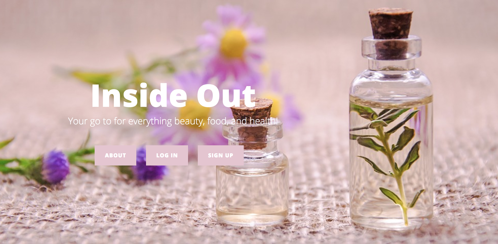

# Inside Out
---
 

#Overview:

+ There are so many blogs and websites that share beauty, fitness, and health information with people but most of these websites have a lot of sponsored content and can sometimes be in-genuine as they are only looking after selling a specific product or promoting specific brand.  

+ I created a web application dedicated to all the females who have tips and tricks to share with others in regards to health, fitness and beauty. Also, for females who have real interest and don't just want to buy into posts they read online. This application provides a community for women to share with each other and learn from each other and excel on all things that will help them Inside and Out. Simply put, a blog where there is no limitations on what you'd like to ask, or share with others.

#MVP

+ A user should be able to create an account, log-in to the account, and create a post.
+ Be able to perform a CRUD (create, read, update, destroy) on the user's profile, and the posts.

# Technology used:

+ Ruby on Rails
+ Ruby
+ jQuery
+ Html
+ CSS
+ Bootstrap
+ Heroku
---
# User Stories:

+ When I type in the URL, I'm able to see a homepage for the website and title name
+ I can easily find the login /sign up on this website and can easily navigate between both.
+ If I have any errors will logging in, I am easily informed and given a reason for the error.
+ When I'm successfully signed up or logged in, I am told so with a disappearing flash message.
+ When I sign up, I'm easily/ automatically logged in after.
+ When I log in, I can navigate into my account and access my profile page.
+ I am able to change my name, email and password.
+ When I log in, I can navigate into my account and access my posts.
+ I am able to access my posts, edit them, delete them, and create new ones.
---
# Dream Features:

+ Commenting System on posts
+ Forget Password option
+ Image Uploading
+ Status Id (Published vs Draft)
+ tagging blog posts by interest
